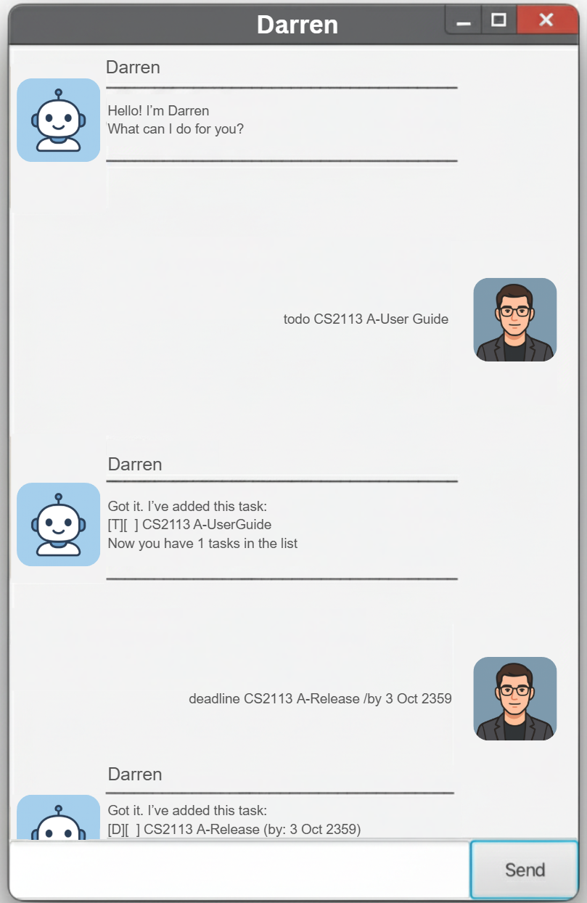

# Darren User Guide



## Introducing ***Darren***, your very own task-managing chatbot!
### Darren keeps track of your <ins>todos</ins>, <ins>deadlines</ins> and <ins>events</ins> seamlessly.

- [Adding Todo Tasks](#adding-todo-tasks)
- [Adding Deadlines](#adding-deadlines)
- [Adding Events](#adding-events)
- [List tasks](#list-tasks)
- [Mark as Done](#mark-as-done)
- [Unmark a completed task](#unmark-a-completed-task)
- [Deleting a task](#deleting-a-task)
- [Finding a task](#finding-a-task)
- [Closing the bot](#closing-the-bot)

## Adding Todo Tasks

Adds a todo task with a description.

Usage: `todo <description>`

Example: `todo CS2113 A-UserGuide`

```
Got it! I've added this task:
    [T][ ] CS2113 A-UserGuide
Now you have 1 tasks in the list.
```


## Adding Deadlines

Adds a task with a description and a due date.


Usage: `deadline <description> /by <date/time>`

Example: `deadline CS2113 A-Release /by 3 Oct 2359`

```
Got it! I've added this task:
    [D][ ] CS2113 A-Release (by: 3 Oct 2359)
Now you have 2 tasks in the list.
```


## Adding Events

Adds a task with a description, with start and end time.

Usage: `event <description> /from <start> /to <end>`

Example: `event Midterms /from 3pm /to 5pm`

```
Got it! I've added this task:
    [E][ ] Midterms (from: 3pm to: 5pm)
Now you have 3 tasks in the list.
```


## List tasks

Lists all the tasks that have been added in order.

Usage: `list`

```
Here are the tasks in your list:
1. [T][ ] CS2113 A-UserGuide
2. [D][ ] CS2113 A-Release (by: 3 Oct 2359)
3. [E][ ] Midterms (from: 3pm to: 5pm)
```


## Mark as Done

Marks a chosen task as completed, based on its task number.

Usage: `mark <task-index>`

Example: `mark 1`

```
Good work! This task has been completed:
    [T][X] CS2113 A-UserGuide
```


## Unmark a completed task

Marks a chosen task as undone, based on its task number.

Usage: `unmark <task-index>`

Example: `unmark 1`

```
Got it! I've marked this task as incomplete.
    [T][ ] CS2113 A-UserGuide
```


## Deleting a task

Removes a chosen task, based on its task number.

Usage: `delete <task-index>`

Example: `delete 1`

```
Noted! I've removed this task:
    [T][ ] CS2113 A-UserGuide
Now you have 2 tasks in the list.
```


## Finding a task

Finding a specific task containing a specific keyword.

Usage: `find <keyword>`

Example: `find CS2113`

```
Here are the matching tasks in your list:
1. [D][ ] CS2113 A-Release (by: 3 Oct 2359)
```

## Closing the bot

Exits the chatbot.

Usage: `bye`

```
Bye! Hope to see you again soon!
```